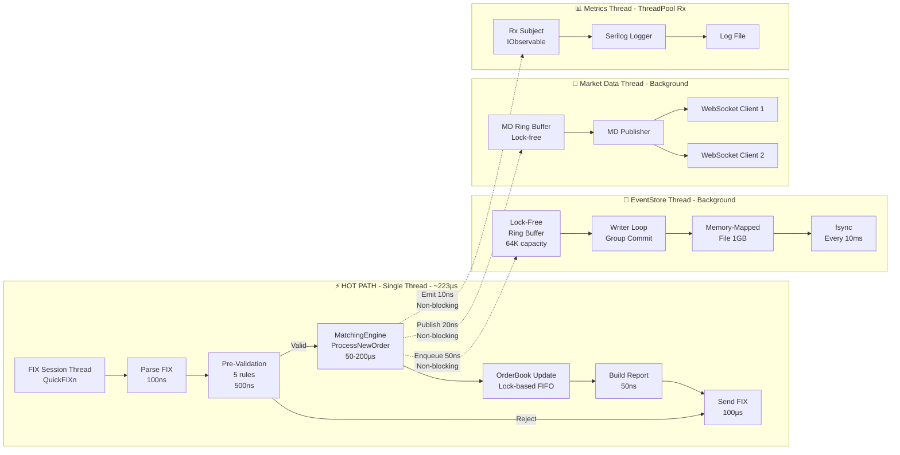

# Async Component Architecture - KlingerExchange

## Separação Hot Path vs Background Threads

Este diagrama ilustra a separação entre o hot path síncrono (single-threaded) e as 3 threads assíncronas que não bloqueiam o processamento de ordens.

## Arquitetura de Componentes

### Hot Path (Thread Principal)
**Características**:
- Single-threaded por design
- Garante ordem FIFO (Price-Time Priority)
- Latência total: ~223µs (média)

**Componentes**:
1. QuickFIXn Session Handler
2. FastOrderParser (zero-allocation)
3. OrderValidator (5 regras + InstrumentValidationCache)
4. MatchingEngine (FIFO matching)
5. ExecutionReportBuilderV2 (object pooling)
6. ExecutionReportDispatcher (thread dedicada, removes ~80-100µs do hot path)

### Async Component 1: EventStore
**Thread**: Background (Priority: HIGHEST)

**Componentes**:
- Lock-Free Ring Buffer (128K capacity)
- Group Commit Writer (batch 100 events)
- Memory-Mapped File (1GB pre-allocated)
- fsync durability (every 1ms)

**Características**:
- Zero blocking no hot path (~200-500ns via ConcurrentQueue)
- Durabilidade com trade-off (1ms window)
- Recovery automático no startup (~80K eventos/seg)
- Watermark monitoring (90%/95% capacity alerts)
- 2 threads: Dispatch (NORMAL) + Writer (HIGHEST)

### Async Component 2: Market Data
**Thread**: Background (Priority: NORMAL)

**Componentes**:
- Lock-Free Ring Buffer (64K messages)
- Trade Publisher
- UDP Multicast Publisher (239.1.1.100:9900)
- Thread Affinity Pinning (Core 2)

**Características**:
- Zero blocking no hot path (~20ns inline TryWrite)
- UDP Multicast broadcast (latência ~2-5µs)
- Pinned memory (unsafe, zero-copy)
- Thread priority HIGHEST
- Não impacta latência de matching

### Async Component 3: Metrics/Logging
**Thread**: ThreadPool via Rx (Priority: NORMAL)

**Componentes**:
- System.Reactive Subject (lock-free)
- LatencyMonitor
- Serilog Async Logger

**Características**:
- Zero blocking no hot path (~10ns emit)
- Logging estruturado assíncrono
- Métricas de performance em tempo real

## Benefícios da Arquitetura

1. **Low Latency**: Hot path focado apenas em matching (~223µs)
2. **Durability**: Persistência sem bloquear hot path
3. **Observability**: Logging/metrics sem impacto
4. **Scalability**: Market data broadcast desacoplado
