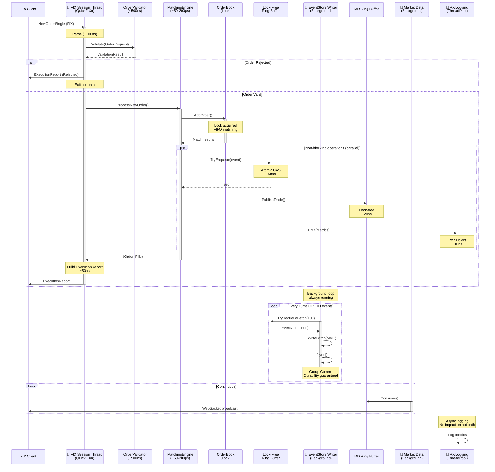

# Order Flow Sequence - KlingerExchange

## Fluxo Temporal de uma Ordem

Este diagrama mostra o fluxo sequencial de uma ordem através das threads do sistema, destacando operações paralelas (não-bloqueantes) e bloqueantes.

## Hot Path vs Background Operations

### Hot Path (Bloqueante - ~140-150µs otimizado)
1. Parse FIX (~100ns)
2. Pre-Validation (~500ns, com cache)
3. Matching Engine (~50-200µs)
4. OrderBook Update (Lock)
5. Build ExecutionReport (~50ns, pooled)
6. Enqueue para ExecutionReportDispatcher (~50ns)

**Nota**: Send FIX (~80-100µs) foi movido para thread separada (ExecutionReportDispatcher)

### Background Operations (Não-bloqueantes)
- **EventStore**: ConcurrentQueue ~200-500ns → Dispatch thread → Ring buffer → Writer (fsync every 1ms)
- **Market Data**: Inline TryWrite ~20ns → UDP Multicast broadcast (~2-5µs)
- **Metrics/Logging**: Emit ~10ns → Background Rx logging
- **ExecutionReport**: Enqueue ~50ns → Dispatcher thread → Send FIX (~80-100µs)

## Pontos de Sincronização

| Ponto | Tipo | Latência | Impacto Hot Path |
|-------|------|----------|------------------|
| OrderBook Lock | Exclusive Lock | Incluído no matching | Sim (bloqueante) |
| EventStore ConcurrentQueue | Lock-based | ~200-500ns | Não (async) |
| EventStore Ring Buffer | Lock-Free CAS (SPSC) | ~50ns | Não (background) |
| MD Ring Buffer | Lock-Free unsafe | ~20ns | Não (async inline) |
| Rx Subject | Lock-Free | ~10ns | Não (async) |
| ExecutionReport Queue | ConcurrentQueue | ~50ns | Não (async) |
