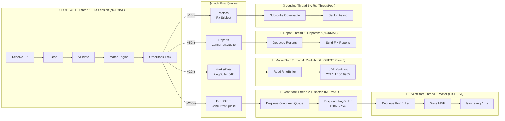

# Thread Architecture - KlingerExchange

## Visão Geral das Threads

O sistema utiliza **6 threads principais** com diferentes prioridades e responsabilidades:

1. **FIX Session Thread** (Priority: NORMAL, Foreground - QuickFIXn)
2. **EventStore Dispatch Thread** (Priority: NORMAL, Foreground)
3. **EventStore Writer Thread** (Priority: HIGHEST, Foreground)
4. **Market Data Thread** (Priority: HIGHEST, Background - pinned Core 2)
5. **ExecutionReport Dispatcher** (Priority: NORMAL, Foreground)
6. **Rx Metrics/Logging Thread** (Priority: NORMAL, ThreadPool)

---

## Diagrama de Threads e Sincronização



---

## Resumo de Latências

| Operação | Thread | Latência | Bloqueante? |
|----------|--------|----------|-------------|
| Parse FIX | FIX Session | ~100ns | Sim |
| Validação | FIX Session | ~500ns | Sim |
| Matching | Main | ~50-200µs | Sim |
| Enqueue EventStore | Main | ~200-500ns (ConcurrentQueue) | Não |
| Publish MD | Main | ~20ns (inline TryWrite) | Não |
| Emit Métrica | Main | ~10ns | Não |
| Build Report | Main | ~50ns | Sim |
| Send FIX | Main | ~100µs | Sim |
| **Total Hot Path** | - | **~223µs (avg)** | - |
| Persist to Disk | Background | ~5-10ms (amortizado) | Não |

---

## Características Críticas

### 1. Single-Threaded Matching (Thread 1)
- MatchingEngine processa ordens sequencialmente
- Garante ordem FIFO estrita (Price-Time Priority)
- OrderBook usa lock exclusivo para proteção de estado

### 2. Lock-Free Enqueue
- EventStore: `ConcurrentQueue` + dispatch thread (~200-500ns)
- Market Data: `unsafe` ring buffer com atomic pointers (~20ns)
- Rx Metrics: Lock-free Observable pattern (~10ns)

### 2a. Market Data UDP Multicast
- Endereço: `239.1.1.100:9900`
- Loopback habilitado (local testing)
- Buffer: 256KB
- TTL: 1 (local network)
- Zero-copy com pinned memory
- Thread pinning: Core 2 (CPU affinity)

### 3. Thread Priorities
```csharp
_writerThread.Priority = ThreadPriority.Highest;  // EventStore
// QuickFIXn Session = ThreadPriority.Normal (default)
```

### 4. Group Commit Strategy
**Condições para flush**:
- Batch atingiu 100 eventos, OU
- 1ms desde último flush

**Durabilidade**: `FileStream.Flush(flushToDisk: true)` → fsync()  
**Trade-off**: 1ms window (~10-20 eventos em risco de perda)

**Ring Buffer**: 128K eventos (doubled for safety)  
**Watermark Alerts**: Warning @ 90%, Critical @ 95%

### 5. Startup Recovery
```csharp
EnableEventStore() 
  → TryRecoverFromEventStore()
  → EventStoreReader.ReadAll()
  → OrderBookRebuilder.Replay()
```
- Executa antes de aceitar conexões FIX
- Performance: ~80K eventos/seg (~50ms para 4K eventos)

---

## Componentes Extras (Otimizações)

### Object Pooling
- **ExecutionReportBuilderV2**: Pool de objetos para reduzir alocações
- **InstrumentValidationCache**: Cache de metadados (~50ns lookup)

### Thread Affinity
- **UdpMulticastPublisher**: P/Invoke `SetThreadAffinityMask` (Windows)
- Pina thread no Core 2 (binary `100`)
- Reduz context switching

## Arquivos Relacionados

- `EventStore/EventStoreWriter.cs` - Writer thread (HIGHEST priority)
- `EventStore/EventStoreDispatcher.cs` - Dispatch thread (NORMAL priority)
- `EventStore/LockFreeRingBuffer.cs` - Queue lock-free 128K
- `Matching/Engine/MatchingEngine.cs` - Hot path single-threaded
- `Matching/Events/MetricsEventBus.cs` - Rx.Subject para logging assíncrono
- `MarketData/Core/RingBuffer.cs` - Market data ring buffer 64K
- `MarketData/Publisher/UdpMulticastPublisher.cs` - UDP multicast com thread pinning
- `Oms/Service/ExecutionReportDispatcher.cs` - FIX report dispatcher thread
